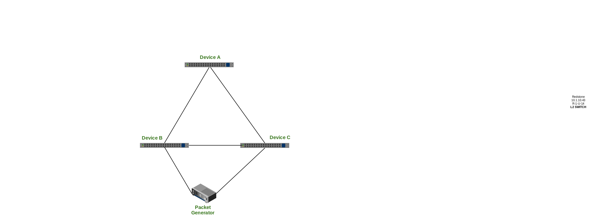

# Network Chaos Honey badger

Chaos Honey badger randomly breaks link in a network. This will test the network resiliency
and convergence times.

Network Setup
=============

####Events handling :
The asicd daemon supports signaling/notification of asynchronous events. The notification engine employs a nano message based publisher. Notifications for the following events are supported
- Port operational state changes
- Vlan/Lag interface creation/deletion
- IP interface operational state changes

